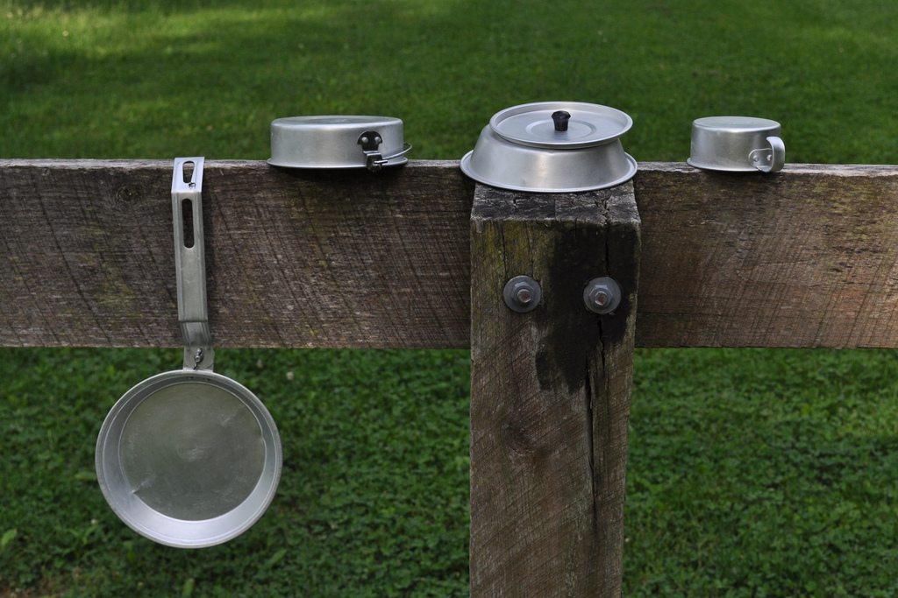
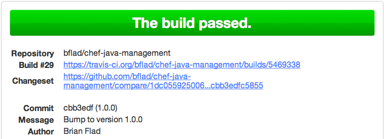

!SLIDE center

[http://www.flickr.com/photos/uncle_paul/7192436950/](http://www.flickr.com/photos/uncle_paul/7192436950/)

!SLIDE

## Mess Kit ##

!SLIDE

Git

!SLIDE

Librarian / Berkshelf

!SLIDE smaller

    # Opscode community cookbooks
    cookbook "ant", :git => "https://github.com/opscode-cookbooks/ant"
    ...
    # Internal cookbooks
    cookbook "agent99", :git => "ssh://git@stash.example.com:7999/COOKBOOKS/agent99.git"
    ...
    # Third-Party cookbooks
    cookbook "auto-patch", :git => "https://github.com/bflad/chef-auto-patch"
    ...

!SLIDE bullets

.notes Chef file, organization, and node management
.notes Provider provisioning
.notes CLIs for other devices and services

Knife Plugins

!SLIDE smaller

    gem "knife-bulkchangeenvironment"
    gem "knife-cisco_asa"
    gem "knife-ec2"
    gem "knife-env-diff"
    gem "knife-essentials"
    gem "knife-flip"
    gem "knife-lastrun"
    gem "knife-preflight"
    gem "knife-rhn"
    gem "knife-spork"
    gem "knife-stash"
    gem "knife-vsphere"

!SLIDE

Knife Tricks: [http://dougireton.com/blog/2013/02/03/knife-tricks/](http://dougireton.com/blog/2013/02/03/knife-tricks/)

!SLIDE

Foodcritic / Travis CI

!SLIDE center

!SLIDE

Vagrant
