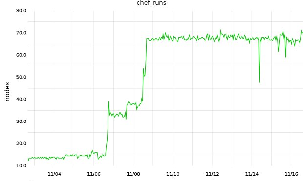
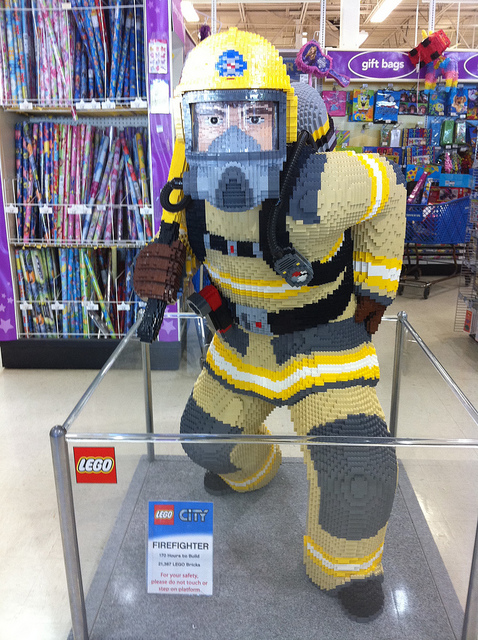

!SLIDE

# How'd I Get There? #

!SLIDE

Cfengine 2, really?

!SLIDE center smaller

.notes 1998

[http://www.imdb.com/title/tt0118715/](http://www.imdb.com/title/tt0118715/)

!SLIDE smaller

.notes Custom coding

Let's not talk about the custom coding.

    { /etc/fail2ban/jail.conf
      BeginGroupIfLineContaining "ignoreip = 127.0.0.1"
        LocateLineMatching "ignoreip = 127\.0\.0\.1"
        ReplaceLineWith "ignoreip = 127.0.0.1 10.0.0.200 128.91.90.59 192.168.4.155"
      EndGroup
      ResetSearch "1"
      BeginGroupIfLineContaining "[ssh-iptables]"
        DeleteLinesContaining "sendmail-whois[name=SSH, dest=root, sender=fail2ban@mail.com]"
        LocateLineMatching "maxretry = 5"
        ReplaceLineWith "maxretry = 10"
      EndGroup
      DefineClasses "service_fail2ban_restart"
    }

!SLIDE bullets incremental

Asking for help usually went something like:

* Me: anyone know what's going on?
* Others: nope.
* Me: well, that's just great.
* Others: use Chef or Puppet and we can help.

!SLIDE

Configuration management shouldn't be its own special snowflake.

!SLIDE

## Chef Beginnings ##

!SLIDE

Started small with the NTP cookbook (classic example) on a test node.

!SLIDE

    package 'ntp'
    
    template '/etc/ntp.conf' do
      source    'ntp.conf.erb'
      notifies  :restart, 'service[ntpd]'
    end
    
    service 'ntpd' do
      action [:enable, :start]
    end

!SLIDE

Helped understanding of all the cookbook components (attributes, recipes, templates, etc.) to build a base role.

!SLIDE

Next, did the most logical thing*: bootstrapped all nodes.

!SLIDE center

!SLIDE

## Standing on the Shoulders of Giants ##

Learned a few things from industry leaders at ChefConf 2012.

!SLIDE

Example: [http://www.slideshare.net/mcdonnps/lessons-from-etsy-avoiding-kitchen-nightmares-chefconf-2012](http://www.slideshare.net/mcdonnps/lessons-from-etsy-avoiding-kitchen-nightmares-chefconf-2012)

* Unobtrusive notifications: IRC
* Metrics: Graphite
* Change management: knife spork

!SLIDE center smaller

[http://www.flickr.com/photos/cdevers/4765629067/](http://www.flickr.com/photos/cdevers/4765629067/)

!SLIDE

Everything now feels like building blocks.
